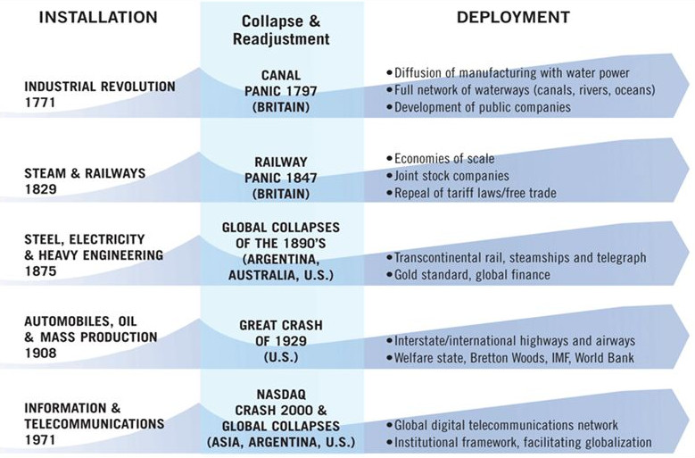

Since the invention of the first mechanical computer by Charles Babbage in the early 19th century and the conceptualization of the modern computer by Alan Turing in 1936, Information Technologies have constantly revolutionized science, the economy and now society as a whole.

#### Digitalization is encompassing the whole society^[Digitalization is both affecting the entire society at large and affecting each component (people, organizations, policies, economic, societal, …)] {-}

Since the 1990's, we live times of uncertainty [@Perez2004]. The world is digitizing so rapidly that most users are scrambling to adapt [@Manyika2015]. Basically, the present period is defined as one of transition between two distinct technological styles, or techno-economic paradigms, and at the same time as the period of construction of a new mode of growth. Such long waves of technological change affect the whole system, the entire structure of society, worldwide. Technological change is a complex social process involving technical, economic, social and institutional factors in a mesh of interactions [@Perez2004].

There are mechanisms inherent to the way technologies diffuse which result in technological revolutions or changes of paradigm every fifty or sixty years. This results in long term patterns of continuity and discontinuity in the techno-economic sphere which require matching transformations at the socio-institutional level. The general framework of socioeconomic regulation has a natural inertia. So, during paradigm transitions, there are very intense transformations in technology and the economy and a high level of inertia and confusion in the socio-institutional sphere. As a result, the social consequences of each transition are vast and profound, as is the human suffering [@Perez2004].

#### Digitalization is yet another technological revolution {- #technological-revolution}

> "As the century closed, the world became smaller. The public rapidly gained access to new and dramatically faster communication technologies. Every day brought forth new technological advances to which the old business models seemed no longer to apply. Yet, somehow, the basic laws of economics asserted themselves. Those who mastered these laws survived in the new environment. Those who did not, failed."

A prophecy for the next decade? No. You have just read a description of what happened a hundred years ago when the twentieth-century industrial giants emerged. Using the infrastructure of the emerging electricity and telephone networks, these industrialists transformed the U.S. economy, just as today's Silicon Valley entrepreneurs are drawing on computer and communications infrastructure to transform the world's economy [@Shapiro1999].

The different phases of such a technological revolution is shown in figure \ref{technological_revolution}:

![The different phases of a technological revolution [@Perez2004]\label{technological_revolution} ](sources/images/technological_revolution.png){width=85% height=85%}

Diffusion in the early phase demands a simple vehicle of propagation : long-term cost effectiveness provided by a "key factor". Each revolution has its key factor [@Perez2004]:

- Railways & the steam engine: cheap coal
- Electricity, heavy chemistry and heavy civil engineering: cheap steel
- Asphalt roads and automobiles: cheap petroleum
- Information & telecommunications: cheap electronic chips

Those technological revolutions are outlined in figure \ref{technological_revolutions}:

{width=90% height=90%}

In each case, the "key factor" steers engineering and investment decisions towards its intensive use [@Perez2004]. Each key factor has its infrastructure: in our case, cheap electronic chips are enabling cheap networking and communications through the Internet. In other words, a technological revolution is the convergence of many technologies, that are combined together and maturing at the same time.

Technology changes. Economic laws do not [@Shapiro1999].

#### Digitalization is polarizing the world {-}

In each country, centrifugal trends generate unprecedented growth and wealth, at one end, and increasing poverty, deterioration and degradation, at the other [@Perez2004]. Digitization is happening unevenly, and users with advanced digital capabilities are capturing disproportionate benefits [@Manyika2015].

Those trends involve widespread unemployment; the obsolescence of qualifications at all levels, the geographic dislocation of people and activities; the growth of rapid wealth at one end and of growing poverty at the other [@Perez2004]. There will be more economic dislocation : the day-to-day nature of work will change, companies redefine many roles and job displacement rates could accelerate sharply over the next decade [@Manyika2015].

![Centrifugal trends [@Perez2004]\label{centrifugal_trends}](sources/images/centrifugal_trends.png){width=75% height=75%}

Also a new and more pervasive dynamic appears to be at work : the gap between the digital "haves" and "have-mores" is growing as the most advanced users pull away from everyone else [@Manyika2015].

#### Digitalization is a complex phenomenon impulsing change at all scales {-}

The literature about digitalization and the current technological revolution tries to summarize the main facts, suggests strategies to follow and decisions to take about it. However, each paper is tackling the problem from its own perspective, so it is not easy to understand the phenomenon globally.

For example, @Perez2004 analyses each techno-economic paradigm through three inter-related levels: Technology Systems (microelectronics, software & telecommunications), "Best Practice" Model (flexible organizational model), "Common Sense" Principles for Organizational & Institutional Design (decentralization, networking, continuous improvement, ...). @Gimpel2012 states that digitalization is changing business and society through five digital forces: Globalization, Millenialization, Prosumerization, Business Virtualization and Platformization. It seems that each author suggests different dimensions to analyze digitalization.

Without a unifying intellectual framework to understand digitalization, it seems uneasy to deal with everyday issues such as:

- Is the diffusion of smartphones driving decentralization in an organization?
- What kind of skill is useful to thrive in a job market where automation and machines seem to be nibbling every job? Should we favor emotional intelligence or computer programming?
- Is the email improving an organization's performance by accelerating communication or worsening it by fostering bureaucracy ?

Digitalization is impulsing change at all scales, it is a perturbation^[It is tempting to call this perturbation a "disruption". However it does not fit the definition of disruption given in the paragraph about [rate of disruption](#rate-of-disruption).] created, transmitted and amplified through an environment made of a mesh of humans and machines interconnected by relations, as would a fire in a forest or a virus in a community. Digitalization is spreading from one organization to another and through organizations as people change their behavior. They become accustomed to new technologies as they are deployed in their organizations.

#### Stimulus-Response {-}

The first dimension of Digitalization that we will use in this document relates to the direction of the perturbation we describe: is it inward, i.e. a **Stimulus**? or outward, i.e. a **Response**? This dimension encompasses the fact that change is the result of an interaction between an entity and its environment, as meant by the chinese keyword [**_gǎnyìng_**](https://en.wikipedia.org/wiki/Ganying) meaning _correlative resonance_ (which stems from **_gǎn_** meaning _feel, sense, touch, be affected_ and **_yìng_** meaning _respond, answer, adapt to, deal with_). Other word associations like **Action-Reaction**, **Input-Output** would have been suitable also.

In this context, **Stimulus** refers to the changes which do not originate in the organizations but rather from its environment and its stakeholders. On the other hand, **Response** refers to the changes which originate in the organization and modify its behavior towards its environment and stakeholders.

  - What is changing?
  - What can you do about it?
  - What is influencing your behavior?
  - What kind of behavior should be favored?
  - What is the new context for organizations?
  - How can organizations adapt to it?
  - How can you adapt to it?
  - What are the risks and opportunities of this change?

#### Actor-Organization {-}

The second dimenson of Digitalization we will use in this document relates to the scale at which we describe the perturbation: does it impact a single entity, i.e. an **Actor**? or a group of entities, i.e. an **Organization**? Thus we inspire from a widely-used sociological tool, named [**Actor-Network theory**](https://en.wikipedia.org/wiki/Actor%E2%80%93network_theory), which describes an Organization by identifying the Actors which compose it, including machines, and the Network of relations which connects those actors. In other words, an Organization is defined by its Network of Actors. The term _Network_ has been replaced by _Organization_ because of its strong technological meaning in the field of telecommunications in the context of this report. Other word associations like **Microeconomic-Macroeconomic**, **Unit-Group**, **Small-Big** would have been suitable also.

In this context, **Actor** refers to all the tangible and intangible entities contained in an organization. The main entities of an organization are the people belonging to that organization. Coherently, the other entities we consider are those which can interact with (or can be handled by) a human: tangible like a computer, a car, a desk, a smartphone or intangible like an application, a database, a knowledge, a technology or money. On the other hand, **Organization** refers to the combination of those entities through a network of interactions and flows. An organization could be of any form, but most of the organizations we consider in this report have a hierarchical structure. Hierarchical organizations are pretty common but it is only one type among others.

  - What is happening locally?
  - What is happening globally?
  - What is happening from the point of view of a single human?
  - What are the technologies at hand?
  - What are the new systems of technologies and humans?
  - How are organized Digital Organizations?

#### An intellectual journey to understand digitalization {-}

To understand the whole Digitalization phenomenon, we suggest to follow an intellectual journey which encompasses those 2 dimensions: going from inward Stimulus at Actors' level to inward Stimulus at Organizational level to outward Response at Organizational level to outward Response at Actors' level.

1. **Stimulus from Actors**

    What are the digital technologies at hand ? How are they used in our daily lives? What are our new behaviors as customers? as employees?

2. **Stimulus from Organizations**

    From these stimuli at actors' level, what are the changes impacting the efficiency of organizations? How are the most efficient organizations behaving? How are they structured? What is changed in the market dynamics?

3. **Response of Organizations**

    From these stimuli at organizational level, how an organization should adapt? Does it need to change its structure? Where should it be headed by its leaders? What kind of strategy can be envisioned? What kind of culture is needed?

4. **Response of Actors**

    From these responses at organizational level, what kind of local action can be triggered? What kind of technologies could be used and how? For each individual, what kind of behavior should be encouraged? What are the required competencies of the leaders?

Then, using this intellectual framework, we propose **a tool to support digital transformation efforts for Organizations' leaders**.
